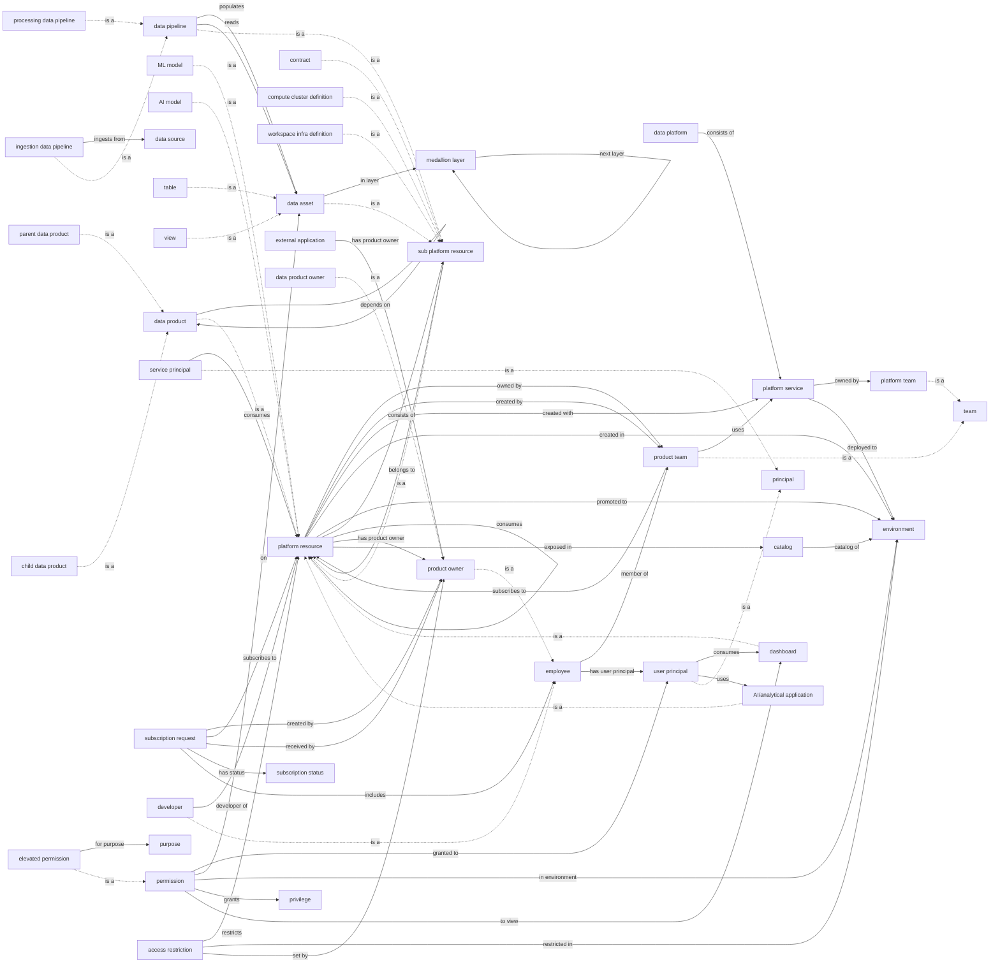

<!-- Generated by domain-model from the YAML sources of this folder. Do not edit. -->

# AcmeDataPlatform: diagrams

The whole domain (all levels).

## Taxonomy (is-a)

```mermaid
flowchart BT
    DataPlatform["data platform"]
    PlatformService["platform service"]
    PlatformResource["platform resource"]
    DataProduct["data product"]
    Dashboard["dashboard"]
    MLModel["ML model"]
    AIModel["AI model"]
    AIAnalyticalApplication["AI/analytical application"]
    SubPlatformResource["sub platform resource"]
    DataContract["contract"]
    DataPipeline["data pipeline"]
    ComputeClusterDefinition["compute cluster definition"]
    WorkspaceInfraDefinition["workspace infra definition"]
    DataAsset["data asset"]
    ParentDataProduct["parent data product"]
    ChildDataProduct["child data product"]
    Table["table"]
    View["view"]
    IngestionDataPipeline["ingestion data pipeline"]
    ProcessingDataPipeline["processing data pipeline"]
    DataSource["data source"]
    MedallionLayer["medallion layer"]
    Principal["principal"]
    UserPrincipal["user principal"]
    ServicePrincipal["service principal"]
    ExternalApplication["external application"]
    ProductOwner["product owner"]
    DataProductOwner["data product owner"]
    Catalog["catalog"]
    SubscriptionRequest["subscription request"]
    SubscriptionStatus["subscription status"]
    Employee["employee"]
    Developer["developer"]
    Permission["permission"]
    ElevatedPermission["elevated permission"]
    Privilege["privilege"]
    Purpose["purpose"]
    AccessRestriction["access restriction"]
    Team["team"]
    PlatformTeam["platform team"]
    ProductTeam["product team"]
    Environment["environment"]
    DataProduct --> PlatformResource
    Dashboard --> PlatformResource
    MLModel --> PlatformResource
    AIModel --> PlatformResource
    AIAnalyticalApplication --> PlatformResource
    SubPlatformResource --> PlatformResource
    DataContract --> SubPlatformResource
    DataPipeline --> SubPlatformResource
    ComputeClusterDefinition --> SubPlatformResource
    WorkspaceInfraDefinition --> SubPlatformResource
    DataAsset --> SubPlatformResource
    ParentDataProduct --> DataProduct
    ChildDataProduct --> DataProduct
    Table --> DataAsset
    View --> DataAsset
    IngestionDataPipeline --> DataPipeline
    ProcessingDataPipeline --> DataPipeline
    UserPrincipal --> Principal
    ServicePrincipal --> Principal
    ProductOwner --> Employee
    DataProductOwner --> ProductOwner
    Developer --> Employee
    ElevatedPermission --> Permission
    PlatformTeam --> Team
    ProductTeam --> Team
```

## Ontology graph

```mermaid
flowchart LR
    DataPlatform["data platform"]
    PlatformService["platform service"]
    PlatformResource["platform resource"]
    DataProduct["data product"]
    Dashboard["dashboard"]
    MLModel["ML model"]
    AIModel["AI model"]
    AIAnalyticalApplication["AI/analytical application"]
    SubPlatformResource["sub platform resource"]
    DataContract["contract"]
    DataPipeline["data pipeline"]
    ComputeClusterDefinition["compute cluster definition"]
    WorkspaceInfraDefinition["workspace infra definition"]
    DataAsset["data asset"]
    ParentDataProduct["parent data product"]
    ChildDataProduct["child data product"]
    Table["table"]
    View["view"]
    IngestionDataPipeline["ingestion data pipeline"]
    ProcessingDataPipeline["processing data pipeline"]
    DataSource["data source"]
    MedallionLayer["medallion layer"]
    Principal["principal"]
    UserPrincipal["user principal"]
    ServicePrincipal["service principal"]
    ExternalApplication["external application"]
    ProductOwner["product owner"]
    DataProductOwner["data product owner"]
    Catalog["catalog"]
    SubscriptionRequest["subscription request"]
    SubscriptionStatus["subscription status"]
    Employee["employee"]
    Developer["developer"]
    Permission["permission"]
    ElevatedPermission["elevated permission"]
    Privilege["privilege"]
    Purpose["purpose"]
    AccessRestriction["access restriction"]
    Team["team"]
    PlatformTeam["platform team"]
    ProductTeam["product team"]
    Environment["environment"]
    DataPlatform -->|"consists of"| PlatformService
    PlatformService -->|"owned by"| PlatformTeam
    PlatformResource -->|"owned by"| ProductTeam
    ProductTeam -->|"uses"| PlatformService
    ProductTeam -->|"subscribes to"| PlatformResource
    PlatformResource -->|"created by"| ProductTeam
    PlatformResource -->|"created with"| PlatformService
    PlatformService -->|"deployed to"| Environment
    PlatformResource -->|"created in"| Environment
    PlatformResource -->|"promoted to"| Environment
    PlatformResource -->|"consists of"| SubPlatformResource
    SubPlatformResource -->|"belongs to"| PlatformResource
    DataProduct -->|"depends on"| DataProduct
    DataPipeline -->|"populates"| DataAsset
    DataPipeline -->|"reads"| DataAsset
    IngestionDataPipeline -->|"ingests from"| DataSource
    DataAsset -->|"in layer"| MedallionLayer
    MedallionLayer -->|"next layer"| MedallionLayer
    PlatformResource -->|"consumes"| PlatformResource
    UserPrincipal -->|"consumes"| Dashboard
    ServicePrincipal -->|"consumes"| PlatformResource
    UserPrincipal -->|"uses"| AIAnalyticalApplication
    PlatformResource -->|"has product owner"| ProductOwner
    Employee -->|"member of"| ProductTeam
    PlatformResource -->|"exposed in"| Catalog
    SubscriptionRequest -->|"created by"| ProductOwner
    SubscriptionRequest -->|"subscribes to"| PlatformResource
    SubscriptionRequest -->|"received by"| ProductOwner
    SubscriptionRequest -->|"has status"| SubscriptionStatus
    Catalog -->|"catalog of"| Environment
    Employee -->|"has user principal"| UserPrincipal
    ExternalApplication -->|"has product owner"| ProductOwner
    SubscriptionRequest -->|"includes"| Employee
    Developer -->|"developer of"| PlatformResource
    Permission -->|"granted to"| UserPrincipal
    Permission -->|"on"| DataAsset
    Permission -->|"in environment"| Environment
    Permission -->|"grants"| Privilege
    ElevatedPermission -->|"for purpose"| Purpose
    AccessRestriction -->|"restricts"| PlatformResource
    AccessRestriction -->|"restricted in"| Environment
    AccessRestriction -->|"set by"| ProductOwner
    Permission -->|"to view"| Dashboard
    DataProduct -.->|"is a"| PlatformResource
    Dashboard -.->|"is a"| PlatformResource
    MLModel -.->|"is a"| PlatformResource
    AIModel -.->|"is a"| PlatformResource
    AIAnalyticalApplication -.->|"is a"| PlatformResource
    SubPlatformResource -.->|"is a"| PlatformResource
    DataContract -.->|"is a"| SubPlatformResource
    DataPipeline -.->|"is a"| SubPlatformResource
    ComputeClusterDefinition -.->|"is a"| SubPlatformResource
    WorkspaceInfraDefinition -.->|"is a"| SubPlatformResource
    DataAsset -.->|"is a"| SubPlatformResource
    ParentDataProduct -.->|"is a"| DataProduct
    ChildDataProduct -.->|"is a"| DataProduct
    Table -.->|"is a"| DataAsset
    View -.->|"is a"| DataAsset
    IngestionDataPipeline -.->|"is a"| DataPipeline
    ProcessingDataPipeline -.->|"is a"| DataPipeline
    UserPrincipal -.->|"is a"| Principal
    ServicePrincipal -.->|"is a"| Principal
    ProductOwner -.->|"is a"| Employee
    DataProductOwner -.->|"is a"| ProductOwner
    Developer -.->|"is a"| Employee
    ElevatedPermission -.->|"is a"| Permission
    PlatformTeam -.->|"is a"| Team
    ProductTeam -.->|"is a"| Team
```
